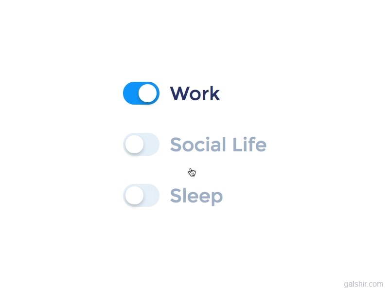

<h4 align="center"><samp> 👋🏾 Welcome to My Github (Call me Krish) </samp>
</h4>

<div align="center">
<h4>💬 <samp> To reach me: </samp><br></h4>
<a href="https://x.com/krish2kdev"></a> &nbsp; <a href="https://www.linkedin.com/in/krish2kdev"></a> &nbsp; <a href="mailto:gvskhrithi2k@aol.com"></a>
</div>

```
krish2kdev@github:~$ whoami
```

```
Name: G V S Krishna Hrithik

Location: Hyderabad, India
```

<p align="center">
    
</p>

  
  - 💻 <samp> Working at Pegasystems Inc. </samp>
  - 🌱 <samp> Brushing up many of the <b>Software Engineering</b> concepts </samp>
  - 💬 <samp> Discuss anything related to <b>Tech</b> <i>(time to become limitless, my friend!)</i> </samp>

Inspired From [GsnMithra](https://github.com/GsnMithra)

<!--

#### 💬 <samp> To reach me: </samp>
[](https://twitter.com/krish2kdev)  &nbsp; [](https://www.linkedin.com/in/krish2kdev/)  &nbsp; <a href="mailto:gvskhrithi2k@aol.com"> 

**krish2kdev/krish2kdev** is a ✨ _special_ ✨ repository because its `README.md` (this file) appears on your GitHub profile.

Here are some ideas to get you started:

- 🔭 I’m currently working on ...
- 🌱 I’m currently learning ...
- 👯 I’m looking to collaborate on ...
- 🤔 I’m looking for help with ...
- 💬 Ask me about ...
- 📫 How to reach me: ...
- 😄 Pronouns: ...
- ⚡ Fun fact: ...
-->
